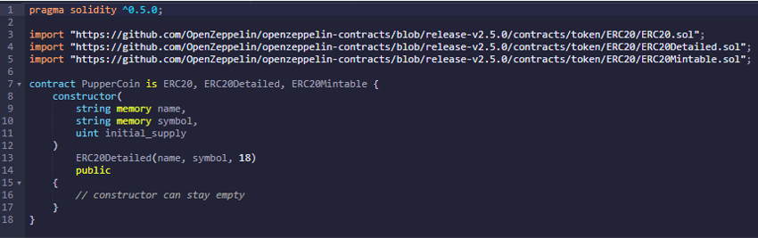
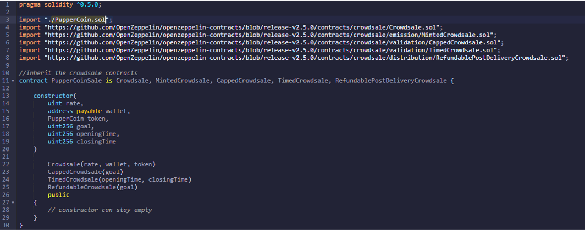
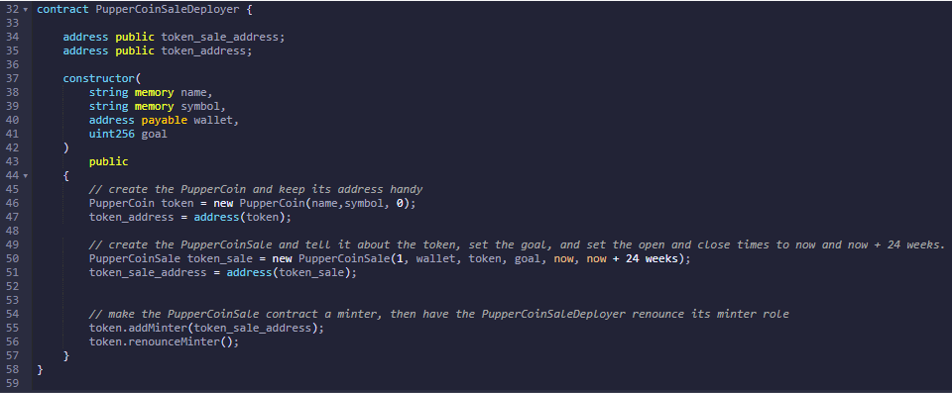
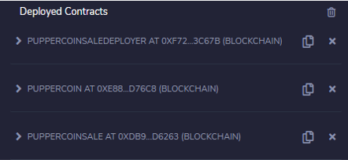
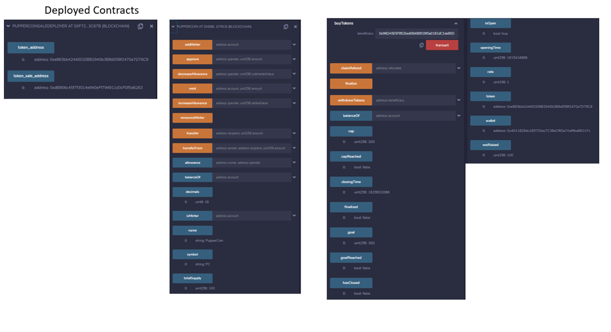
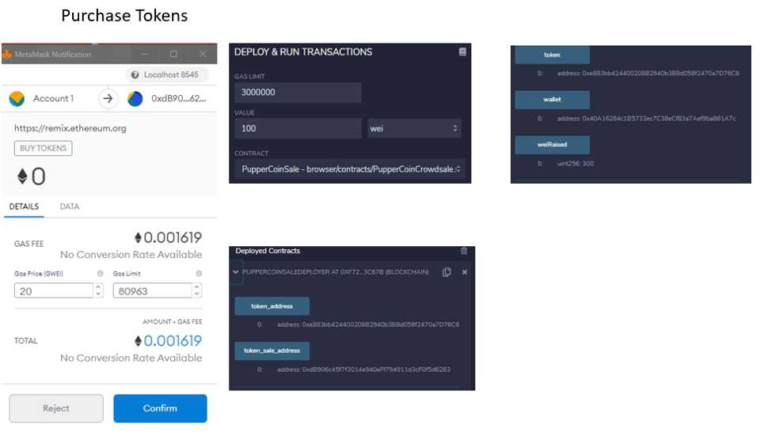
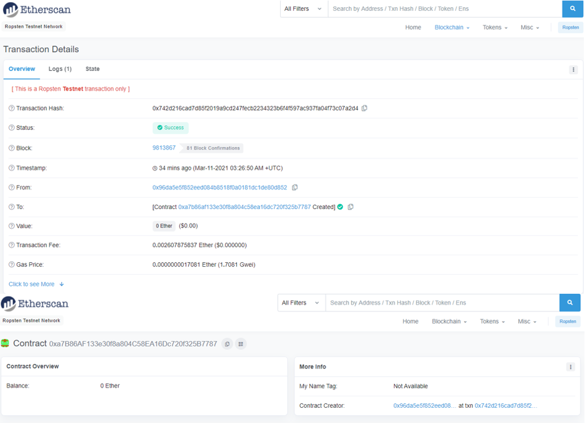
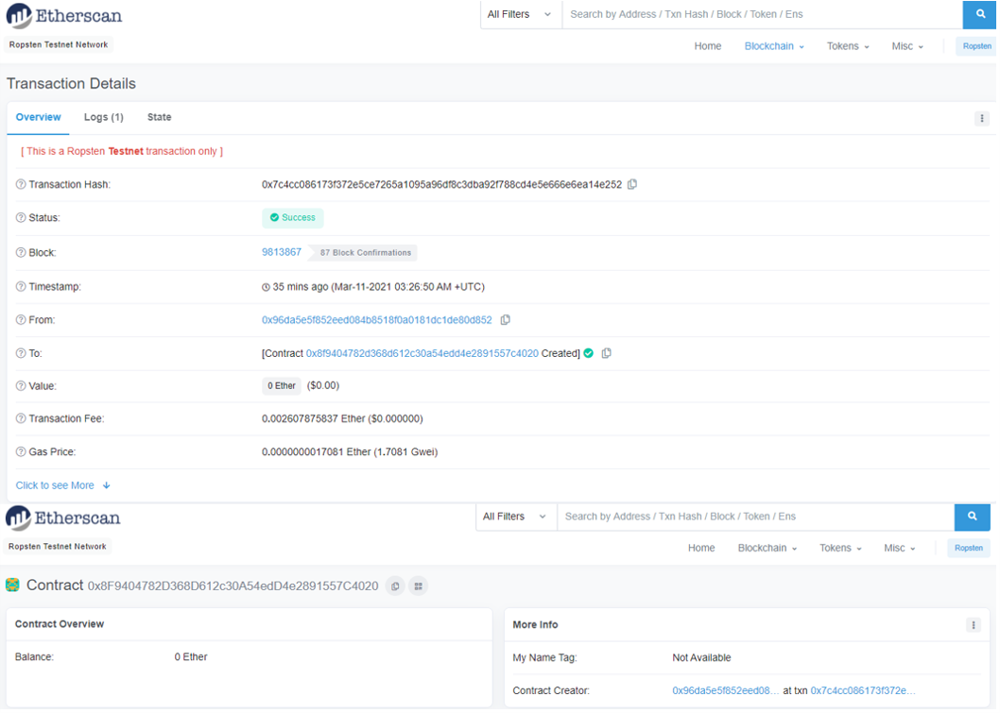

# Advanced Solidity

In this project, I worked to create an ERC20 token that will be minted through a Crowdsale contract that I can leverage from the OpenZeppelin Solidity library.

This crowdsale contract will manage the entire process, allowing users to send ETH and get back PC (PupperCoin). This contract will mint the tokens automatically and distribute them to buyers in one transaction.

This contract inherits `Crowdsale`, `CappedCrowdsale`, `TimedCrowdsale`, `RefundableCrowdsale`, and `MintedCrowdsale` contracts.

I will conduct the crowdsale on Ropsten testnet in order to get a real-world pre-production test.

# PupperCoin.sol

 I start by creating in Remix a standard `ERC20Mintable` token in contract ` PupperCoin.sol`. The code for this coin is attached in file `PupperCoin` and is as follows:

# PupperCoinSale.sol

Next, I create `PupperCoinSale.sol` which inherits `PupperCoin.sol` as well as `Crowdsale.sol`, `MintedCrowdsale.sol`,  `CappedCrowdsale.sol`, `TimedCrowdsale.sol` and `RefundablePostDeliveryCrowdsale.sol`.

The code for `PupperCoinSale.sol` is shown here:

# PupperCoinSaleDeployer.sol

This contract deploys crowdsale and its code is shown here:

Both `PupperCoinSale.sol` and `PupperCoinSaleDeployer.sol` are combined in the attached file `PupperCoinCrowdsale`.

# Testing and Deploying the Crowdsale

The Crowdsale was originally deployed in `Remix` on my local  `Ganache` chain by connecting to `Injected Web3` and ensuring `MetaMask` is pointed to `localhost:8545`.

The Crowdsale worked on my local chain. Here are some screenshots of purchase transactions and of token balances following the transactions.

Following the tests on my local `Ganache`, I deployed the contracts on `Ropsten Test Network`:

Here are the screenshots of the transactions that deployed two contracts, `PupperCoinSaleDeployer.sol` and `PupperCoin.sol`, and also the addresses of these contracts as shown on Etherscan:

`PupperCoinSaleDeployer.sol` 

`PupperCoin.sol`

